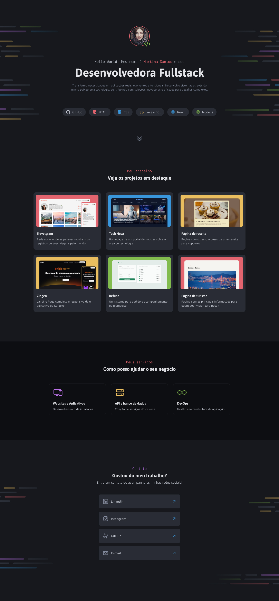

#Olá 👋🏽, seja bem vindo ao projeto Portfólio Dev

Esse projeto se baseia em um site desktop de portfólio para desenvolvedores, com links para projetos e contato do profissional.

Funções utilizadas nesse projeto:

- Criação de layout com CSS
- Posicionamento de elementos
- Variáveis CSS
- CSS Flexbox
- CSS Grid
- pseudo-class e pseudo-elements

##Portfólio Dev

